# veam-installation
veam-installation

```
wget http://repository.veeam.com/backup/linux/agent/dpkg/debian/public/pool/veeam/v/veeam-release-deb/veeam-release-deb_1.0.8_amd64.deb
wget https://download2.veeam.com/VAL/v5/veeam-recovery-media-5.0.2.4567_x86_64.iso

apt install pve-headers # for PVE hosts
apt install squashfs-tools libisoburn1 xorriso
apt-get install linux-headers-$(uname -r)
apt install cifs-utils nfs-common # for using with samba and nfs shares
```
Add repo:

```
dpkg -i veeam-release-deb_1.0.8_amd64.deb
```

Run veeam
```
# veeam
```

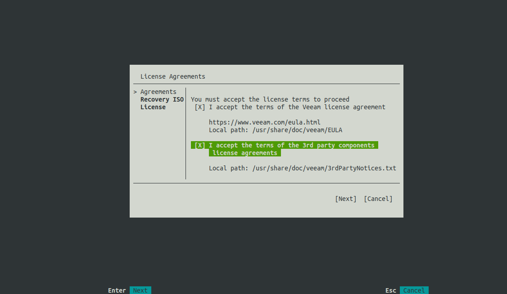

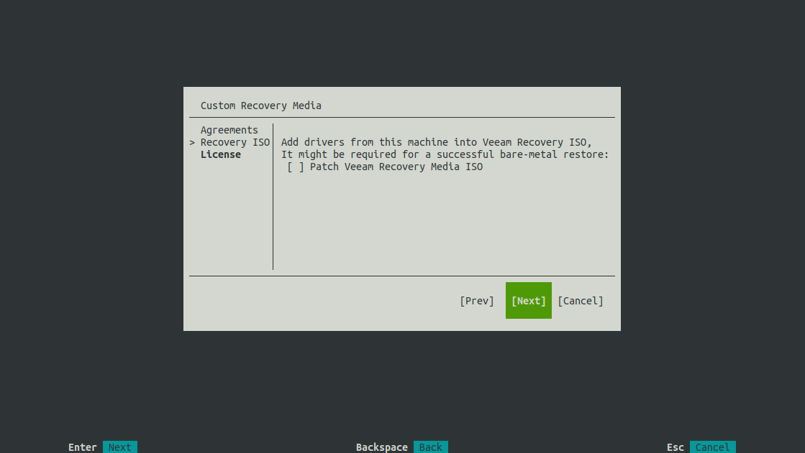

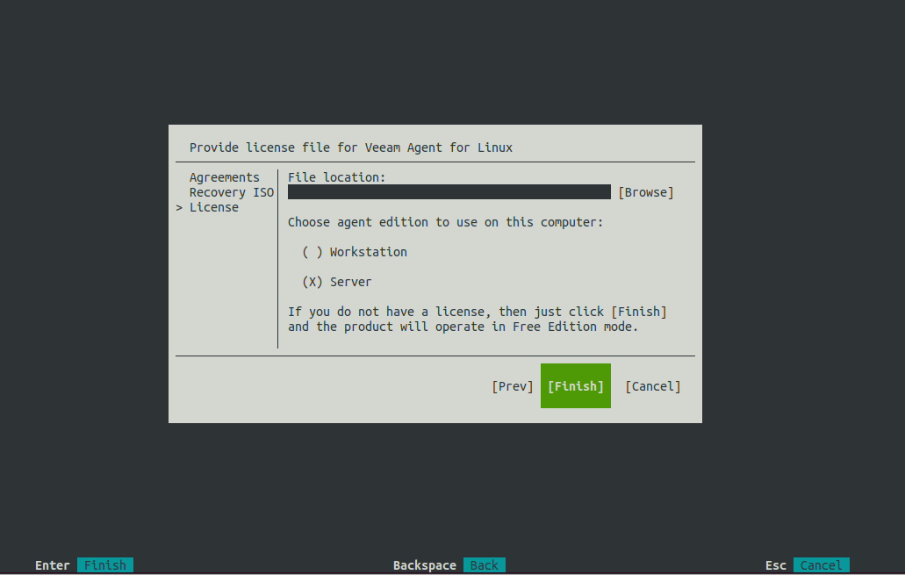

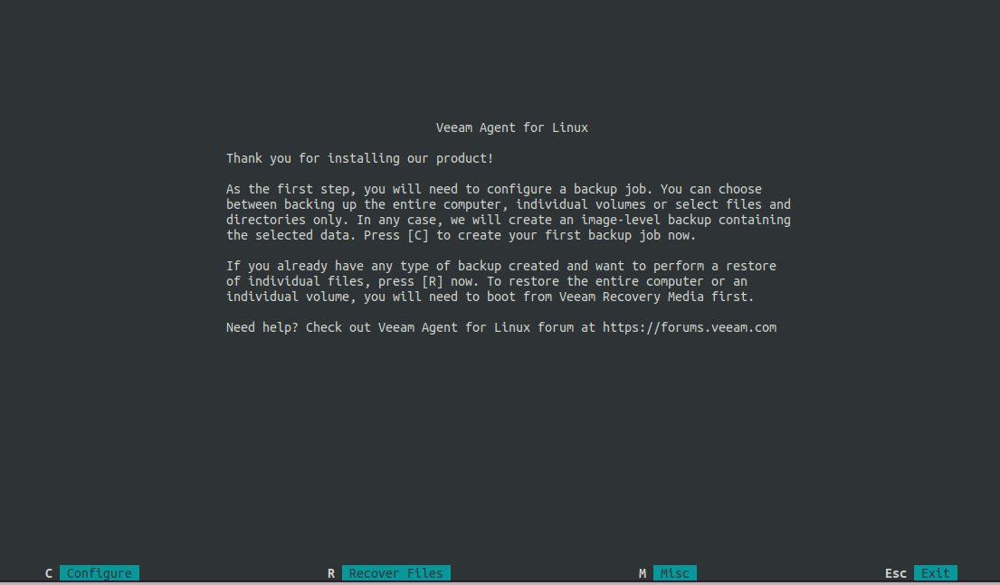

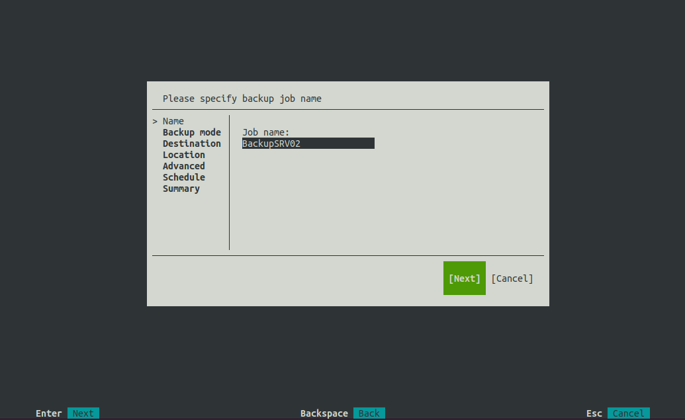

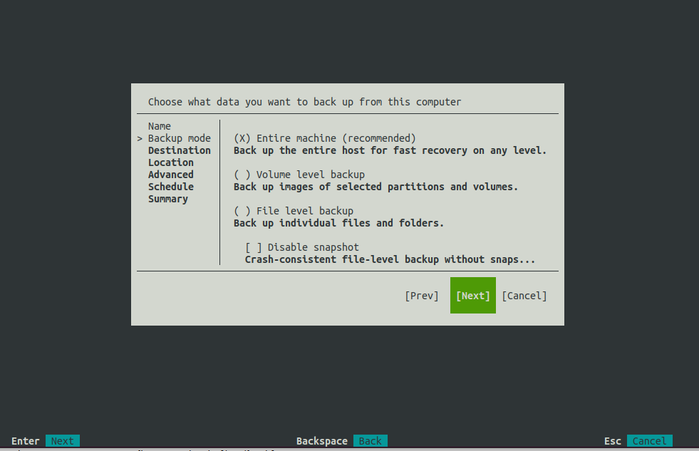

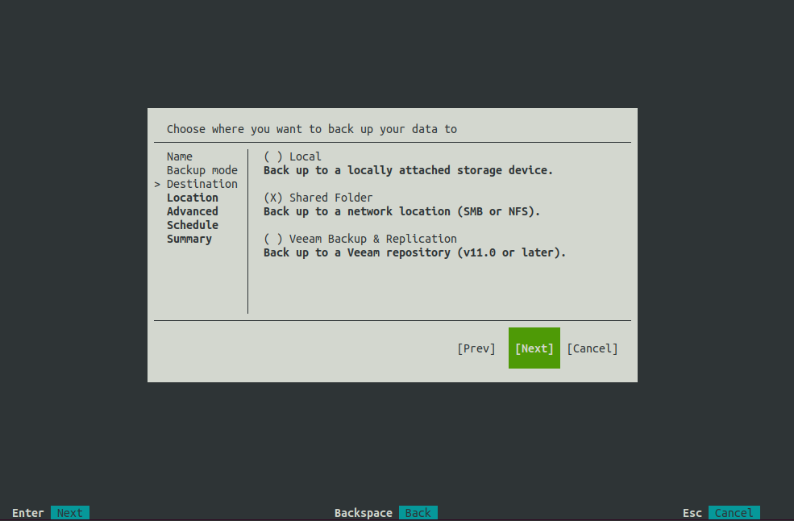

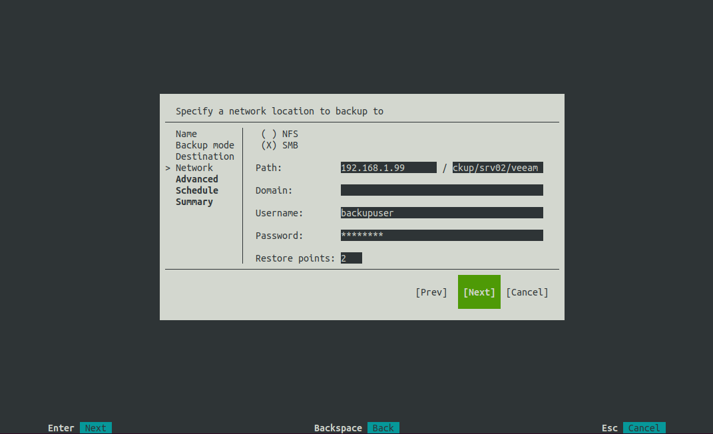

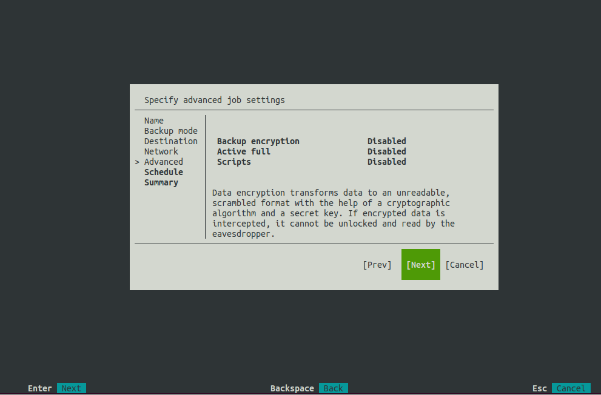

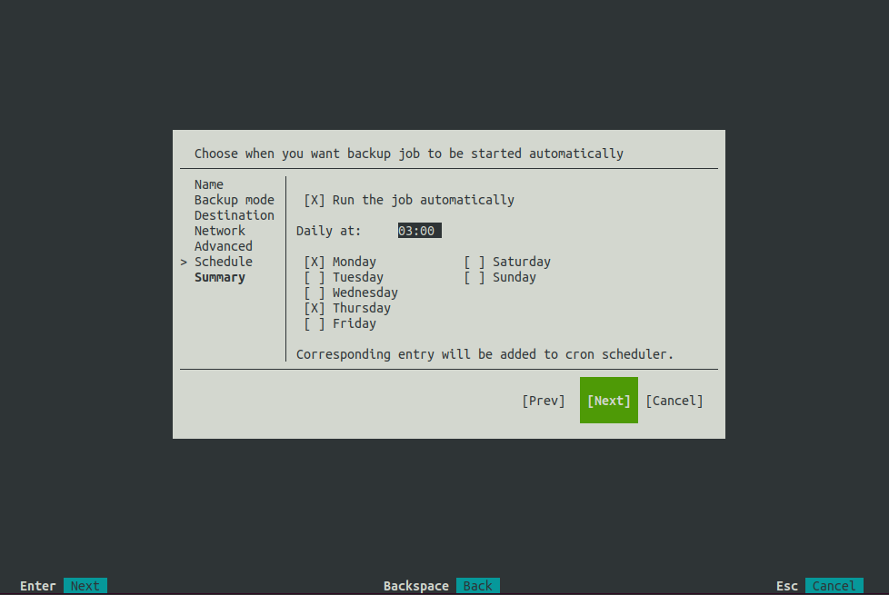

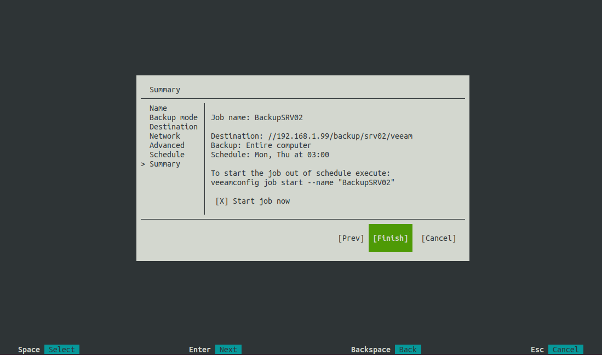


```
root@srv02:/tmp# systemctl status veeamservice
● veeamservice.service - Veeam Agent for Linux service daemon
     Loaded: loaded (/lib/systemd/system/veeamservice.service; enabled; vendor preset: enabled)
     Active: active (running) since Sat 2022-10-22 13:02:55 BST; 6min ago
    Process: 1133118 ExecStart=/usr/sbin/veeamservice --daemonize --pidfile=${PIDFILE} (code=exited, status=0/SUCCESS)
   Main PID: 1133161 (veeamservice)
      Tasks: 46 (limit: 4425)
     Memory: 13.5M
        CPU: 559ms
     CGroup: /system.slice/veeamservice.service
             └─1133161 /usr/sbin/veeamservice --pidfile /var/run/veeamservice.pid --daemon

Oct 22 13:02:55 srv02 systemd[1]: Starting Veeam Agent for Linux service daemon...
Oct 22 13:02:55 srv02 veeamservice[1133161]: Service started.
Oct 22 13:02:55 srv02 veeamservice[1133161]: Initializing log file [/var/log/veeam/veeamsvc.log].
Oct 22 13:02:55 srv02 systemd[1]: Started Veeam Agent for Linux service daemon.
Oct 22 13:08:48 srv02 crontab[1134929]: (root) BEGIN EDIT (root)
Oct 22 13:08:48 srv02 crontab[1134929]: (root) END EDIT (root)
```

